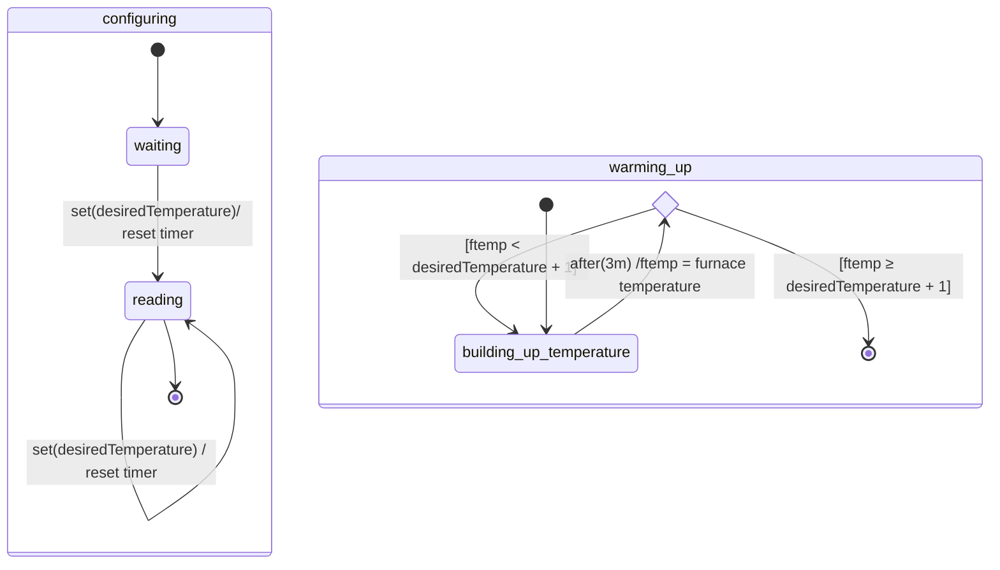

```mermaid
stateDiagram

state idle
state configuring {
	state waiting
	state reading
	[*] --> waiting
    waiting --> reading: set(desiredTemperature)/ reset timer
    reading --> reading: set(desiredTemperature) / reset timer
    reading --> [*]
}
state warming_up {
	state c1 <<choice>>
    state building_up_temperature

    c1 --> building_up_temperature: [ftemp < desiredTemperature + 1]
    c1 --> [*]: [ftemp ≥ desiredTemperature + 1]
    [*] --> building_up_temperature
    building_up_temperature --> c1: after(3m) /ftemp = furnace temperature
}

```
