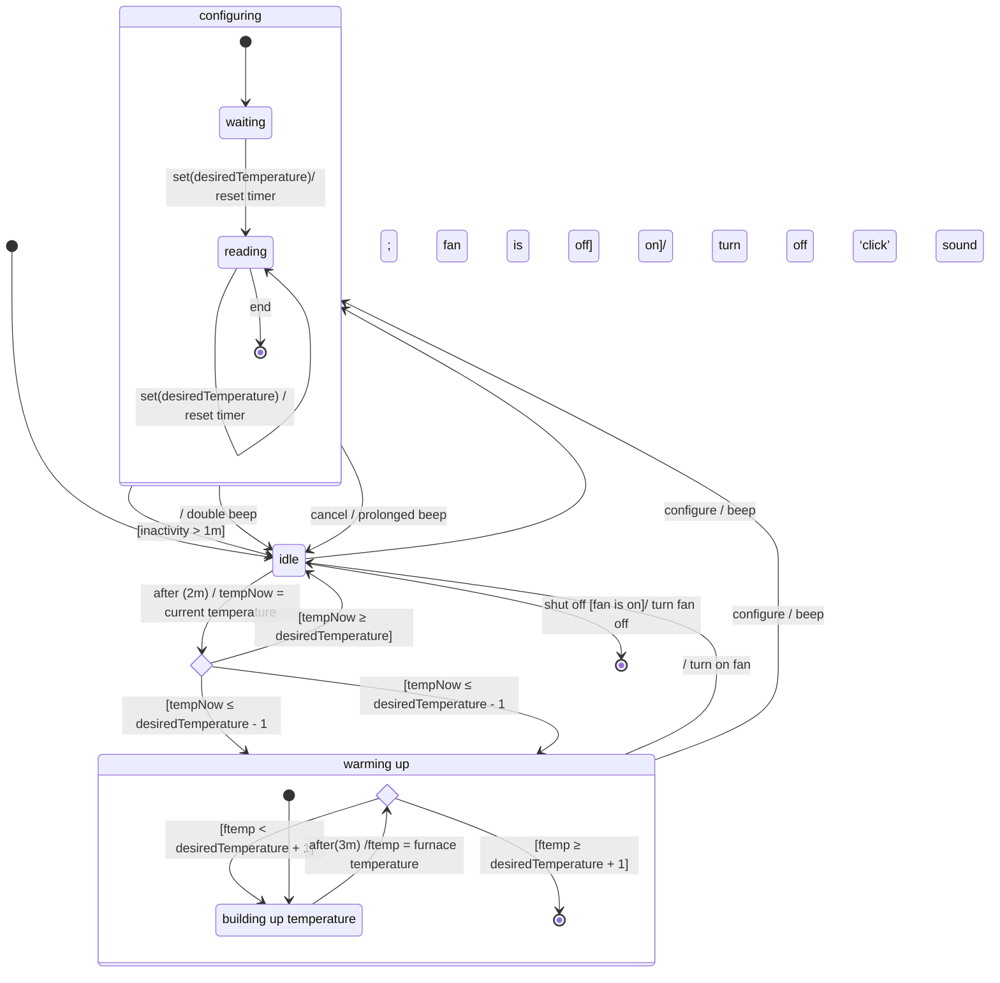

```mermaid
stateDiagram

state idle 
state configuring {
    [*] --> waiting
    waiting --> reading: set(desiredTemperature)/ reset timer
    reading --> reading: set(desiredTemperature) / reset timer
    reading --> [*]: end
}
state "warming up" as warming_up {
    state c1 <<choice>>
    state "building up temperature" as but

    c1 --> but: [ftemp < desiredTemperature + 1]
    c1 --> [*]: [ftemp ≥ desiredTemperature + 1]
    [*] --> but
    but --> c1: after(3m) /ftemp = furnace temperature
}
state c2 <<choice>>
[*] --> idle
idle --> [*]: shut off [fan is on]/ turn fan off
idle --> configuring: configure / beep
idle --> c2: after (2m) / tempNow = current temperature
c2 --> idle: [tempNow ≥ desiredTemperature]
c2 --> warming_up: [tempNow ≤ desiredTemperature - 1; fan is off]
c2 --> warming_up: [tempNow ≤ desiredTemperature - 1; fan is on]/ turn fan off
warming_up --> idle: / turn on fan; ‘click’ sound
warming_up --> configuring: configure / beep
configuring --> idle: [inactivity > 1m]
configuring --> idle: / double beep
configuring --> idle: cancel / prolonged beep

```